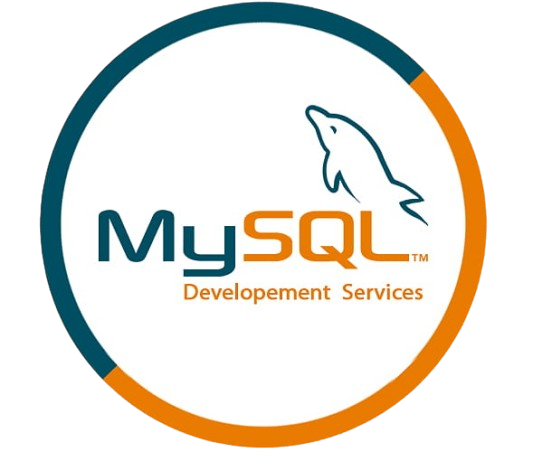

# Get data app
This app does bla bla bla...

### How to use the app
1. clode this repository
> git clone repository_URL
2. create a virtual environment
> python -m venv env
3. install requirements
> pip install -r requirements.txt

### How to use this module
```py
print("hello world!")
x = 10
y = 20
print(x + y)
```
### Screenshots


